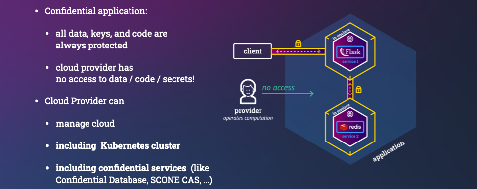
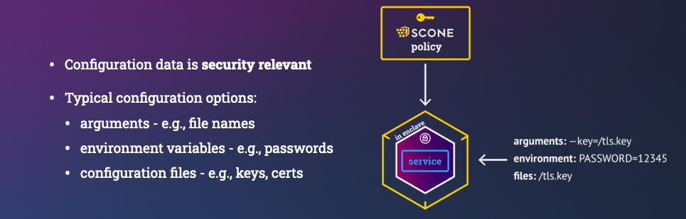
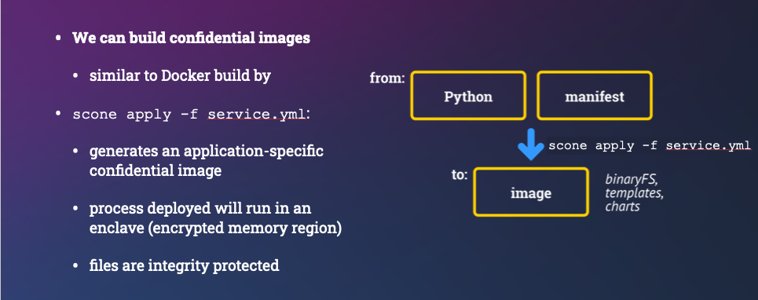
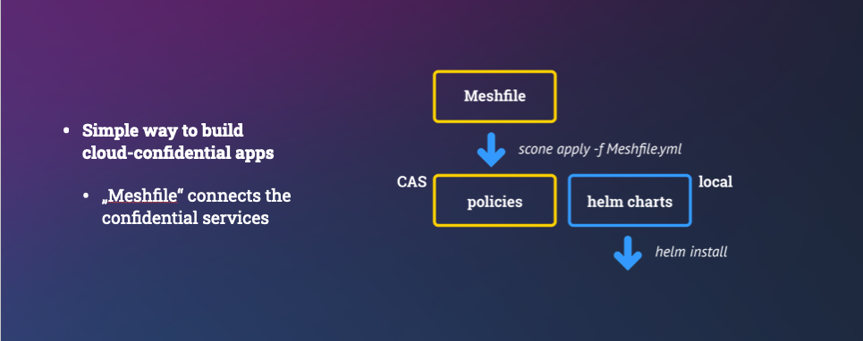
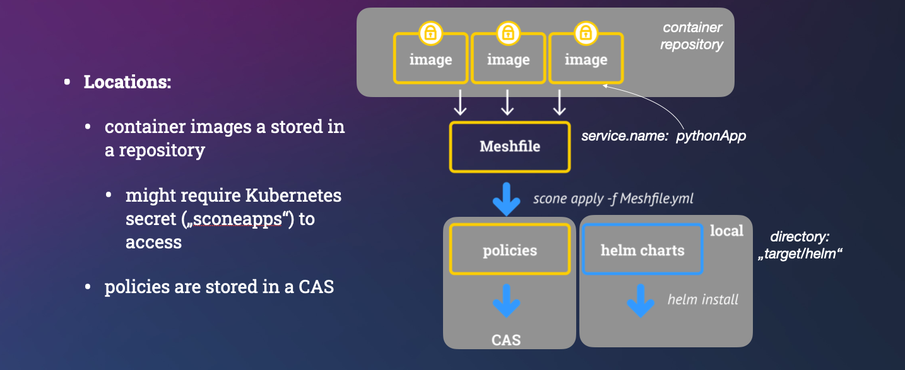
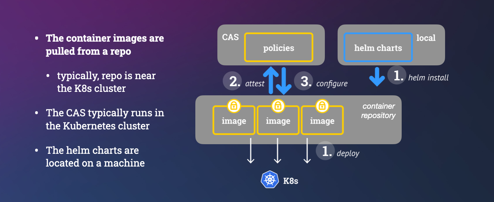
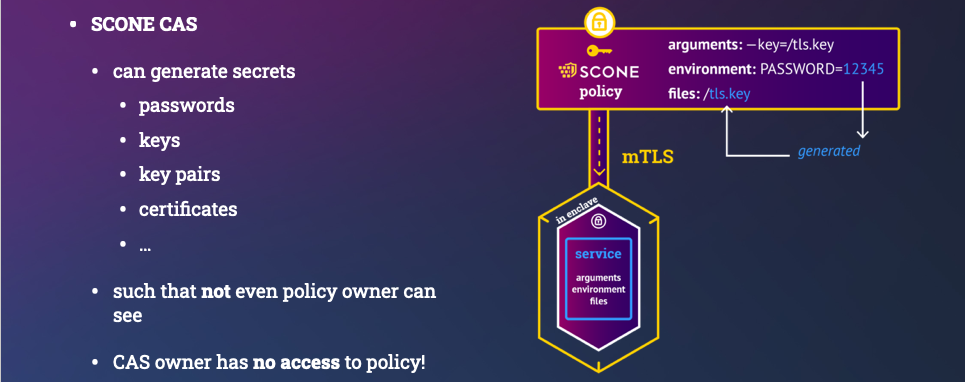
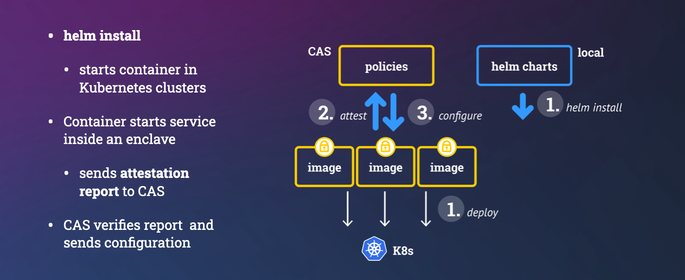

## Detailed Explanation 

In case you are interested in what is going on under the hood,  we explain the steps in some more details below.

### Building a Confidential Image

Our objective is to build a confidential container image to run this application in an encrypted memory region (a.k.a. enclave) and ensure that environment variables are securely passed to the application only after the application was attested and verified. Otherwise, one could, by changing the arguments passed to a Python engine, run completely different functionality.

Note that we want to outsource the management of Kubernetes to an external provider. Hence, we do not want Kubernetes nor any Kubernetes admin to be able to see the value of our environment variables - at no time: neither during the runtime nor during the startup time. Of course, only our original Python program should be able to be able to access the value. Any modification of the Python program must be detected.

Note also that the cloud provider takes care of the integrity of the Kubernetes cluster using traditional isolation mechanisms (e.g., isolation using VMs and containers).  Kubernetes will not have access to any data, code, or key material of the application: their confidentiality, integrity and freshness will all be protected by SCONE.



#### The Manifest Files

We can build a confidential container images and applications consisting of multiple container images with the help of a manifests:

- `Meshfile`:  describes how to build an application consisting of one or more images. This is defined by the application owner. This can define values that need to be **integrity** and **freshness** protected. We should avoid to define values that need to be **confidential** since admins of the application owner might see the meshfile.
- `service manifest`: describes how to build a confidential image to deploy a confidential service. For example, we want to run a Python program inside an enclave. This `service manifest` is defined by the application or service owner.
- `security policy`:  describes how to attest a service and to provision secrets / configuration to a service instance. This is automatically derived form the `meshfile` and `service file`. It can generate secrets that now admin can see. These secrets can be generated inside of an enclave or these secrets can be retrieved from an external key store like a HSM.

##### Service Manifest

Our Python program uses environment variables that need to be protected:

- `API_USER` is an environment variable that is defined in the `Meshfile` . Hence, we add it to the `global` section. We could define a default value in the service manifest. This variable is integrity protected. While a cloud provider would not be able to see the value, an admin of the application owner might be able to see this. (Note that our Python program prints this value on the console indicating that we only want to protect its integrity).

- `API_PASSWORD` is an API password and should not be known by anybody - not even an admin by the application owner. Hence, we ask SCONE CAS (Configuration and Attestation Service) to randomly select it inside an enclave.
  - We define a secret with name `password` as part of the secrets section. This has a length of 10 characters that are randomly selected by SCONE CAS.
  - The value of this secret can be referred to by "$$SCONE::password". This value is only available for our Python program. In general, we recommend to share secrets amongst the services of the same application mesh only.
  - We define this locally in the manifest for this service. Hence, we define it in section `local` - this cannot be modified in the `Meshfile` (i.e., a manifest that describes how to connect services).





We build the confidential container image with the help of the `build` section:

- `name`: set the name of the service deployed with this container image.
- `kind`: `Python says that we need a Python engine to execute this program
- `to`: is the name of the generated image
- `pwd`: the working directory in which our Python program will be located
- `command`:  this is the command line. This is protected to ensure that an adversary cannot change the arguments of our program. Changing the arguments would permit the adversary, for example, to print the value of the environment variables.
- `copy`: a list of files or directories to copy into the image.

```yml
apiVersion: scone/5.8
kind: genservice

# define environment variables
#  - local ones are only visible for this service
#  - global ones are defined for all services in a mesh

environment:
  local:
    - name: SCONE_HEAP
      value: 760M
    - name: SCONE_LOG
      value: error
    - name: API_PASSWORD
      value: "$$SCONE::password$$"  # get from CAS
  global:     # values defined/overwritten in Meshfile
    - name: API_USER  # get value from Meshfile

# define secrets that are managed by CAS 
secrets:
  global: 
  - name: password
    kind: ascii
    size: 10

build:
  name: python_hello_user
  kind: python
  to: registry.scontain.com:5050/cicd/python_hello_user:latest
  pwd: /python
  command: python3 print_env.py
  copy:
    - print_env.py
```

> **NOTE:** You do not need a service manifest for
> **curated confidential service** like `memcached`, `nginx`, `MariaDB`, etc,
> since the images already contain all required information.
> We show this in a [different tutorial](missing link).

> **NOTE:** We typically use one repository near the Kubernetes cluster to store
> all images. 
> We protect the access to this repo using a Kubernetes secret.
> Typically, we use a secret called `sconeapps`,

##### Application Mesh Manifest (aka `Meshfile`)

A cloud-native application typically consists of multiple services. In this example, we start with one service.

To run an application, we need to specify which CAS instance we want to use. Actually, we typically can use multiple CAS instances for various aspects.

Each application must define its own unique CAS namespace. This could have the same name as the namespace that we use to run this application in Kubernetes.

We can define the environment variables that are marked as `global` by the individual services. If no default value was given, we must define a value here.

The service section describes the set of services from which this application is composed of:

- `name`: is a unique name of this service
- `image`: is the name of the image.

```yml
apiVersion: scone/5.8
kind: mesh

cas:
  - name: cas # cas used to store the policy of this application
    alias: ["image", "security", "access", "attestation"] # use alias in case CAS instance has multiple roles
    cas_url: edge.scone-cas.cf  # exported as {{cas_cas_cas_url}}
    tolerance: "--only_for_testing-trust-any --only_for_testing-debug  --only_for_testing-ignore-signer -C -G -S"

policy:
  namespace: myPythonApp    # namespace on CAS instance `cas`

# define environment variables   
env:
  - name: API_USER 
    value: myself
  - name: imagePullSecrets
    value: SconeApps
  - name: APP_SERVICE_PORT
    value: 443

services:
  - name: pythonapp
    image: registry.scontain.com:5050/cicd/python_hello_user:latest
```










