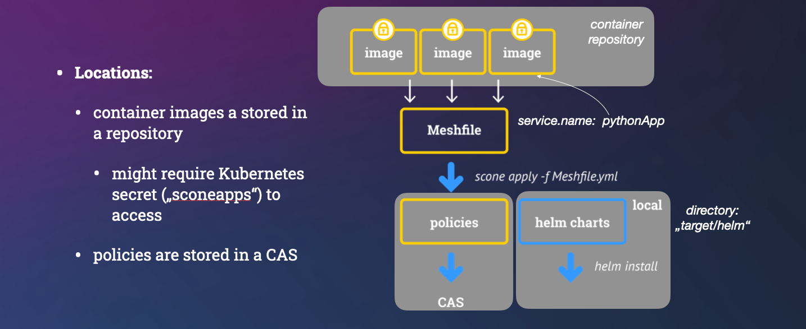
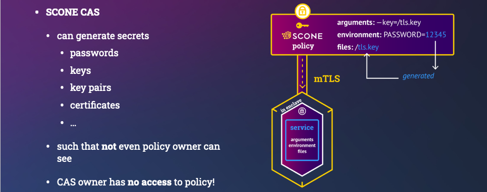
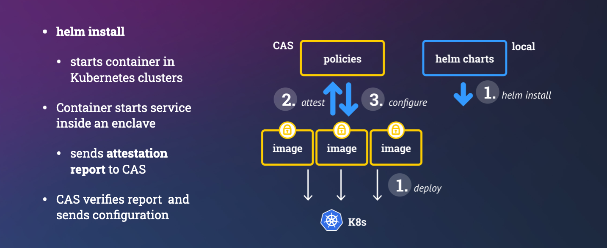

# Confidential Hello World!

In this tutorial we show how to provide a simple cloud-native application with 
a secret such that **nobody** (except our program) can access the secret. 
In fact, not even users with root privileges and cloud providers with hardware 
access can access it or modify the program. 

> **NOTE:** If you want to skip the introductory explanations, 
> you can jump right to the [**Quick Start Guide**](#quick-start-guide). 

> **NOTE:** We also have 
> [other tutorials](https://sconedocs.github.io/workflows/) 
> which you can check out at our SCONE documentation website.

> **NOTE:** In case you are having problems, you can consult 
> [our troubleshooting guide](#troubleshooting).

### Motivation and Use Case Description

In our simple Hello World example, we pass a user ID and a password to a 
Python program. This is actually an API user and password, i.e., no human 
neither needs to nor should know the password. In fact, only *authorized* 
applications has access to the password.

We want to execute this program in a typical environment that is managed by a 
cloud provider. More concretely, we want to run this program as a process running 
in a container running in a Kubernetes pod, running on a Kubernetes node, running 
in a VM running on a server running in some data center. 
So there are multiple nested layers that one might need to be aware of. 
These days, one often outsources the management of these layers to an external 
cloud provider.

The cloud provider operates the hardware, the cloud stack, the operating system, 
and Kubernetes. 
Relying on the cloud provider to do all this decreases the complexity of running 
a cloud application for us, but it usually also forces us to give a lot of power 
and trust to the cloud provider. 
SCONE however, allows us not to have to trust and give this power to neither the 
cloud provider nor malicious root users. 

Using SCONE, despite not having full 
control of neither the hardware nor the software setup, we can ensure that nobody 
(except our program) can change or read our password or can change the user ID or 
other parts of the program. We also ensure that we always run the desired version 
of our program.

## Objectives

The desired level of protection is a **design choice** made by the 
application owner. If this choice changes, the program does not need to be changed.

Our objectives in this tutorial are to provide:

1. confidentiality, integrity and consistency protection of our secret,
2. integrity and consistency protection of the program and user ID. 

> **NOTE:** *Confidentiality protected* means that the protected resource 
> cannot be read by entities not authorized by the security policy of the 
> application.

> **NOTE:** *Integrity protected* means that the protected resource 
> cannot be modified by entities not authorized by the security policy of the 
> application.

> **NOTE:** *Consistency protected* means that the version of the protected 
> resource cannot be changed, unless a software update is authorized by the 
> application owner. 

This means we in this tutorial choose to let the program and the user ID to be 
readable but not changeable, and the password to be neither. 
These properties hold even for people with **root access** and/or **physical access** 
to the hardware.

> **NOTE:** Using SCONE it is also possible to protect the confidentiality of 
> the code so that nobody can view the program, but we do not include this 
> feature in this example.

## Quick Start Guide

### Step 0: Requirements

Many development system will already have most of the necessary
software installed. We provide a `bash` shell script to verify this,
and install what is missing. Run:

```bash
./check_prerequisites.sh
```

to automatically perform the following actions:

1. Update and/or [install rust and cargo](https://doc.rust-lang.org/cargo/getting-started/installation.html). 
2. Install the SCONE command line tool `sconectl`, if not already present. 
3. Check whether [docker](https://docs.docker.com/get-docker/), 
[helm](https://helm.sh/docs/intro/install/) and 
[kubectl](https://kubernetes.io/docs/tasks/tools/#kubectl) are installed.

> **NOTE:** In case rust or cargo are missing, `check_prerequisites.sh` 
> installs them, which relies on `curl` being installed on your system. 

> **NOTE:** Alternatively to using the `check_prerequisites.sh` 
> script, you can install `sconectl` manually by executing 
> `cargo install sconectl`.

> **NOTE:** For information on how to use `sconectl`, run `sconectl --help`

Apart from installing the software handled by the `check_prerequisites.sh` script, 
you also need:

- read and write access to a container registry, where you want to store 
your container image with the Hello World service.
- Access to a [Kubernetes](https://kubernetes.io) cluster, 
to which you want to deploy your Hello World application.
  - On this cluster, you need to install the [SCONE SGX Plugin](https://sconedocs.github.io/helm_sgxdevplugin/) 
      service and the [SCONE LAS](https://sconedocs.github.io/helm_las/) 
      service. Assuming you have the desired kubeconfig file at 
      `~/.kube/config` or pointed to by your `$KUBECONFIG` environment 
      variable, run the following command to do so: 
      ```bash
      sconctl init
      ```

### Step 1: Write the Services of Your Application

Our Hello World program looks like follows and is available in `print_env.py`: 

```python
import os
import time
import hashlib

# Get the environment variables. 
# The value of API_USER is set in the meshfile and therefore 
# visible to the sysadmin of the application owner.
API_USER = os.environ.get('API_USER', None)
# The value of API_PASSWORD is generated by CAS and therefore 
# not visible even to the sysadmin of the application owner.
API_PASSWORD = os.environ.get('API_PASSWORD', None)

# Exit with error if either one is not defined in service.yml.
if API_USER is None or API_PASSWORD is None:
    print("Not all required environment variables are defined!")
    exit(1)

# We can print API_USER, since it, unlike the API_PASSWORD, is not 
# meant to be confidential.
print(f"Hello '{API_USER}' - thanks for passing along the API_PASSWORD", 
      flush=True)

# We print a checksum of API_PASSWORD, since we want to see
# if and when it changes. 
pw_checksum = hashlib.md5(API_PASSWORD.encode('utf-8')).hexdigest()
print(f"The checksum of API_PASSWORD is '{pw_checksum}'")

while True:
  print("Stop me by executing 'helm uninstall pythonapp'", flush=True)
  time.sleep(10)
```

### Step 2: Create the Manifest Files

In general, you need to create one so-called *service manifest file* per service 
and one so-called *mesh manifest file* (a.k.a. *meshfile*) for your application. 
In this Hello World example this amounts to just two files, which
have already been created for you. You just need to:

1. Change the `build.to` tag in the provided `service.yml` file to point to 
the repository and image name and tag, to which you want to upload the generated 
container image containing the service.
2. Change the `services.image` tag in the `mesh.yml` file to point to the same 
image, which you chose to use in the `service.yml` file in the previous step.
3. Change the `policy.namespace` tag in the `mesh.yml` file to a unique 
[SCONE CAS namespace](https://sconedocs.github.io/namespace/) of your choice. 

> **NOTE:** A service manifest file is a `yaml` file, in which you describe the 
service by specifying different properties. These include but are not limited to:
> - Secrets the service imports and exports. 
>    - A secret can be exported either 
>      - to all other services, 
>      - to a specific service or 
>      - to all services in a CAS namespace.
> - The container image and repository to be used to run the service
> - Environment variables
>   - local environment variables are kept confidential, i.e., 
>   they are only visible to the service itself.
>   - global environment variables are visible to all services in a mesh.
> - Arguments

> **NOTE:** The mesh manifest file of an application is a `yaml` file, in which
> you describe the application by specifying different properties. These include
> but are not limited to:
> - Global variables
> - Services and their images
> - [SCONE CAS](https://sconedocs.github.io/public-CAS/) instance and namespace. 
>   - The SCONE CAS instance can be either public or private and potentially run 
> inside the Kubernetes cluster.

### Step 3: Build and Deploy Your Application

Once you have created your manifest files, you only need to run:

```bash
run.sh
```
to build and run your confidential application on Kubernetes.

> **NOTE:** Under the hood `run.sh` executes the following three commands:
> 1. Build the OCI container images containing your services and push it to your 
> repository by executing the following command (once per service):
>
>   ```bash
>   sconectl apply -f service.yml
>   ```
> 2. Build the application mesh: 
>   ```bash
>   sconectl apply -f mesh.yml
>   ```
>   Building the application mesh will
>     - connect the services together and generate a helm chart into `target/helm` 
>   in the current directory on your local machine.
>     - generate the security policies and global variables and upload them to the 
>   SCONE CAS instance specified in the `mesh.yml` file.
> 3. Deploy the application using the generated helm chart:
>   ```bash
>   helm install pythonapp target/helm
>   ```

> **NOTE:** `run.sh` also installs
> any missing requirements (see [Step 0](#step-0-requirements)) by 
> calling `check_prerequisites.sh` and checks whether you have 
> access rights to the SCONE docker image 
> `registry.scontain.com:5050/cicd/sconecli:latest`.
> If the latter fails, check the
> [troubleshooting section](#not-allowed-to-pull-from-scone-registry)
> on what to do.


**Congratulations! You made it!** You now have the confidential 
Hello World application running on your Kubernetes cluster. 

Assuming you have `kubectl` command line completion installed and your kubeconfig
set-up correctly, you can look at the log of the pod of
your service by executing the following command:

```bash
kubectl logs pythonapp<TAB>
```

This should show the following output:

```
Hello 'myself' - thanks for passing along the API_PASSWORD
The checksum of API_PASSWORD is '...'
Stop me by executing 'helm uninstall pythonapp'
Stop me by executing 'helm uninstall pythonapp'
Stop me by executing 'helm uninstall pythonapp'
...
```


In the next step we will show you how you can verify that the 
password, user ID and program indeed are protected according to 
our [objectives](#objectives).

### Step 4: Ensure the Desired Protection

In the section [Objectives](#objectives) we stated how we wanted
to protect our data and program in this tutorial. In this section 
we will show you how to verify that these objectives were achieved, 
one by one.

> **NOTE:** It out of scope of this tutorial to show why a malicious user, 
> authorized as the system administrator of the CAS 
> (as opposed to the system administrator of the application owner), 
> will also fail in attacking the protected resources.

#### Ensure Confidentiality Protection

One of our objectives in this tutorial, was to ensure the confidentiality 
of our password stored in the environment variable `API_PASSWORD`,
whereas both the program itself and the username stored in 
`API_USER` were allowed to be visible.

To check the confidentiality of the password, username and program, 
we perform the following steps:

1. Log in to the container running the Hello World service by executing: 

   ```bash
   kubectl exec -it pythonapp-<TAB> -- bash
   ```

   This will take you to the command line prompt inside the container.
3. Check to make sure you can **_not_** read the value of the password 
environment variable:

   ```bash
   echo $API_PASSWORD
   ``` 

4. Check to make sure you can read the username:

   ```bash
   echo $API_USER`
   ```
   
   The output should be `myself`.

5. Check to make sure you can read the program:

   ```bash
   # find the program inside the container by looking for a unique substring
   grep -re "thanks for passing along" /
   # view the content of the file you found
   cat <program file>
   ```
   The output should be the same program as you wrote 
in [Step 1](#step-1-write-the-services-of-your-application) 
of this tutorial, i.e. the content of `print_env.py` 
in the repository.

#### Ensure Integrity Protection

One of our objectives in this tutorial, was to ensure the integrity 
of our program as well as our username and password, 
that are stored in the environment variables `API_USER` and `API_PASSWORD`, 
respectively. This means we have to verify that one cannot change
those resources without the change being detected.

To check the integrity of the password, username and program, 
we perform the following steps:

1. Try to modify the environment variable `API_PASSWORD`:
   
   ```bash
   # Set the API_PASSWORD environment variable
   export API_PASSWORD="MY NEW INCORRECT PASSWORD"
   # View the API_PASSWORD environment variable
   echo $API_PASSWORD
   ```
   
   Both commands should fail.
3. Try to modify the environment variable `API_USER`:
   
   ```bash
   # Set the API_USER environment variable
   export API_USER="MY NEW INCORRECT PASSWORD"
   # View the API_USER environment variable
   echo $API_USER
   ```
   
   Both commands should fail.
4. Verify the integrety protection of the program: 
   1. Find the program file: 

      ```bash
      grep -re "thanks for passing along" /
      ```
      
   2. Edit the program file. Any change made to the file should make the 
   attestation fail, and the program should fail to run. 
   3. Verify that the edited program fails to run by checking its logs:
   
      ```bash
      # Exit the container
      exit
      # Check the logs 
      kubectl logs pythonapp<TAB>
      ```

#### Ensure Consistency Protection

One of our objective in this tutorial, was to ensure the consistency of 
our program, username and password. This means that we need to show that, 
as soon as the process of the service starts up, 
we detect if somebody tried to revert to an older version of the application. 

> **NOTE:** Changing the values of the username, password and/or program 
> in any other way than running an unintended, previously valid, version
> is prevented by the integrity protection, as opposed to the consistency 
> protection.

To simulate an attack on the consistency protection of one of the three 
resources, i.e., username, password or program code,
we first deploy the application with a new version of the resource, 
and then maliciously try and deploy the  
application with the old version of the resource:

1. To verify the consistency protection of the **password**, 
we would have to create and deploy a new version of the application, 
i.e., version 2, which only differs from version 1 in its password.
The malicious attack would try to revert to use the password of version 1.

   Since the password needs to be confidential, 
even to the sysadmin of the application owner, it is generated by CAS. 

   > **NOTE:** CAS does not regenerate the password 
   > with each new version of the application. 
   > To trigger the regeneration of the password in a new application 
   > version, we need to change the way we want it generated, for example 
   > by changing the length of the password.

   However, as soon as the password is regenerated to be used in version 2, 
the old password is no longer present, neither in CAS nor anywhere else, 
and we therefore have nothing to which we can revert. 
But let us anyway assume that the attacker in some 
way had indeed become a copy of the version 1 password, they would have to 
upload it to CAS, in order for it to be the correct password. 
As soon as the upload to CAS has taken place, however,
this is considered to be a new, authorized version, i.e., version 3. 

   Hence, since we didn't succeed in reverting to the password of version 1 
without the change being detected, 
the attack on the consistency protection of the password failed.

2. To verify the consistency protection of the **username**, 
we would have to create and deploy a new version of the application, 
i.e., version 2, which only differs from version 1 in its username.
The malicious attack would try to revert to use the username of version 1.

   The value of the username is specified in `mesh.yml` and needs to be 
uploaded to CAS for it to be considered to be the correct username. 
To revert to the username of version 1, the attacker would thus have to 
upload it to CAS.
As soon as the upload to CAS has taken place, however,
this is considered to be a new, authorized version, i.e., version 3. 

   Hence, since we didn't succeed in reverting to the username of version 1 
without the change being detected, 
the attack on the consistency protection of the username failed.

1. To verify the consistency protection of the **program**, 
we would have to create and deploy a new version of the application, 
i.e., version 2, which differs from version 1 in its program code.
The malicious attack would try to revert to use the program code of version 1:

   1. Build and deploy version 2: 
      1. Create a new version, i.e., version 2, of the program from 
      [Step 1](#step-1-write-the-services-of-your-application) by adding
      the following line to `print_env.py`:
   
         ```python
         ...
         print(f"This new version of the program also prints this line.", flush=True)
         ...
         ```
   
      2. Change the image tag in `service.yml` under `build.to` to `2`.
      3. Change the image tag in `mesh.yml` under `services.image` to `2`.
      4. Deploy the new version, version 2, of the application:
   
         ```bash
         run.sh
         ```

      5. Verify that version 2 is running, 
         by making sure the added new line is printed in the logs:

         ```bash
         kubectl logs pythonapp<TAB>
         ```
      
   2. Maliciously try to deploy version 1 without it being detected:

      1. Push the image of version 1 to the registry under the tag `2`: 
   
         ```bash
         docker tag <image registry>.<image name>:3 <image registry>.<image name>:4
         docker push <image registry>.<image name>:4
         ```

      2. Deploy the fake version 2:
         ```bash
         helm uninstall pythonapp 
         helm install pythonapp target/helm 
         ```

      3. Verify that the program fails:

         ```bash
         kubectl logs pythonapp<TAB>
         ```
         
      4. If you want, you can fix the application by overwriting 
      the fake version 2 image with the correct version 2:

         ```bash
         run.sh
         ```

## Detailed Explanation 

In case you are interested in what is going on under the hood, 
we explain the steps in some more details below.

### Building a Confidential Image

Our objective is to build a confidential container image to run this application in an encrypted memory region (a.k.a. enclave) and ensure that environment variables are securely passed to the application only after the application was attested and verified. Otherwise, one could, by changing the arguments passed to a Python engine, run completely different functionality.

Note that we want to outsource the management of Kubernetes to an external provider. Hence, we do not want Kubernetes nor any Kubernetes admin to be able to see the value of our environment variables - at no time: neither during the runtime nor during the startup time. Of course, only our original Python program should be able to be able to access the value. Any modification of the Python program must be detected.

Note also that the cloud provider takes care of the integrity of the Kubernetes cluster using traditional isolation mechanisms (e.g., isolation using VMs and containers).  Kubernetes will not have access to any data, code, or key material of the application: their confidentiality, integrity and freshness will all be protected by SCONE. 


#### The Manifest files

We can build a confidential container images and applications consisting of multiple container images with the help of a manifests:

- `meshfile`:  describes how to build an application consisting of one or more images. This is defined by the application owner. This can define values that need to be **integrity** and **freshness** protected. We should avoid to define values that need to be **confidential** since admins of the application owner might see the meshfile.
- `service manifest`: describes how to build a confidential image to deploy a confidential service. For example, we want to run a Python program inside an enclave. This `service manifest` is defined by the application or service owner.
- `security policy`:  describes how to attest a service and to provision secrets / configuration to a service instance. This is automatically derived form the `meshfile` and `service file`. It can generate secrets that now admin can see. These secrets can be generated inside of an enclave or these secrets can be retrieved from an external key store like a HSM.

##### Service Manifest

Our Python program uses environment variables that need to be protected:

- `API_USER` is an environment variable that is defined in the `Meshfile` . Hence, we add it to the `global` section. We could define a default value in the service manifest. This variable is integrity protected. While a cloud provider would not be able to see the value, an admin of the application owner might be able to see this. (Note that our Python program prints this value on the console indicating that we only want to protect its integrity).

- `API_PASSWORD` is an API password and should not be known by anybody - not even an admin by the application owner. Hence, we ask SCONE CAS (Configuration and Attestation Service) to randomly select it inside an enclave.
  - We define a secret with name `password` as part of the secrets section. This has a length of 10 characters that are randomly selected by SCONE CAS.
  - The value of this secret can be referred to by "$$SCONE::password". This value is only available for our Python program. In general, we recommend to share secrets amongst the services of the same application mesh only.
  - We define this locally in the manifest for this service. Hence, we define it in section `local` - this cannot be modified in the `Meshfile` (i.e., a manifest that describes how to connect services).


We build the confidential container image with the help of the `build` section:

- `name`: set the name of the service deployed with this container image.
- `kind`: `Python says that we need a Python engine to execute this program
- `to`: is the name of the generated image
- `pwd`: the working directory in which our Python program will be located
- `command`:  this is the command line. This is protected to ensure that an adversary cannot change the arguments of our program. Changing the arguments would permit the adversary, for example, to print the value of the environment variables.
- `copy`: a list of files or directories to copy into the image.

```yml
apiVersion: scone/5.8
kind: genservice

# define environment variables
#  - local ones are only visible for this service
#  - global ones are defined for all services in a mesh

environment:
  local:
    - name: SCONE_HEAP
      value: 760M
    - name: SCONE_LOG
      value: error
    - name: API_PASSWORD
      value: "$$SCONE::password$$"  # get from CAS
  global:     # values defined/overwritten in Meshfile
    - name: API_USER  # get value from Meshfile

# define secrets that are managed by CAS 
secrets:
  global: 
  - name: password
    kind: ascii
    size: 10

build:
  name: python_hello_user
  kind: python
  to: registry.scontain.com:5050/cicd/python_hello_user:latest
  pwd: /python
  command: python3 print_env.py
  copy:
    - print_env.py
```

> **NOTE:** You do not need a service manifest for 
> **curated confidential service** like `memcached`, `nginx`, `MariaDB`, etc, 
> since the images already contain all required information. 
> We show this in a [different tutorial](missing link).

> **NOTE:** We typically use one repository near the Kubernetes cluster to store 
> all images. 
> We protect the access to this repo using a Kubernetes secret. 
> Typically, we use a secret called `sconeapps`,


##### Application Mesh Manifest (aka `meshfile`)

A cloud-native application typically consists of multiple services. In this example, we start with one service.

To run an application, we need to specify which CAS instance we want to use. Actually, we typically can use multiple CAS instances for various aspects.

Each application must define its own unique CAS namespace. This could have the same name as the namespace that we use to run this application in Kubernetes.

We can define the environment variables that are marked as `global` by the individual services. If no default value was given, we must define a value here.

The service section describes the set of services from which this application is composed of:

- `name`: is a unique name of this service
- `image`: is the name of the image.

```yml
apiVersion: scone/5.8
kind: mesh

cas:
  - name: cas # cas used to store the policy of this application
    alias: ["image", "security", "access", "attestation"] # use alias in case CAS instance has multiple roles
    cas_url: edge.scone-cas.cf  # exported as {{cas_cas_cas_url}}
    tolerance: "--only_for_testing-trust-any --only_for_testing-debug  --only_for_testing-ignore-signer -C -G -S"

policy:
  namespace: myPythonApp    # namespace on CAS instance `cas`

# define environment variables   
env:
  - name: API_USER 
    value: myself
  - name: imagePullSecrets
    value: SconeApps
  - name: APP_SERVICE_PORT
    value: 443

services:
  - name: pythonapp
    image: registry.scontain.com:5050/cicd/python_hello_user:latest
```










## Troubleshooting

### Installation of Rust and Cargo

> **Note**: You can run script `run.sh` to set up / update your rust environment and to  install `sconectl` with the help of Rust. 
> It will however also execute the build and deploy steps of this tutorial.

In case you install manually, errors might appear since Rust is not installed or out-of-date. 
If this is the case and `cargo` fails, ensure that

- you have `Rust` installed on your system. and 
- it is up-to-date (you might get syntax errors if your Rust installation is old).

If Rust is not yet installed or too old, you can use [`rustup`](https://www.rust-lang.org/tools/install) to install `Rust`.

### Docker Container Registry Access

#### Not allowed to pull from scone registry

This could fail for the following two reasons:

1. You have not yet requested access to the SCONE registry, 
which you can do by sending an email to `info@scontain.com` 
and ask for access to the 
`registry.scontain.com:5050/cicd/sconcli` image.  
2. You not have logged in to docker using `docker login` with 
the correct [gitlab access token](https://docs.gitlab.com/ee/user/profile/personal_access_tokens.html). 
[Generate an access token](https://docs.gitlab.com/ee/user/profile/personal_access_tokens.html#create-a-personal-access-token) 
and pass it to `docker login` using the `--password-stdin` argument.

#### Not allowed to push to your registry

In our experience if the line `"credsStore": "desktop"` is present in your 
`~/.docker/config.json` file you might not be able to push to your registry,
although you are logged in to docker and have the correct access rights.

#### Inconsistent Kubernetes Deployment of Application

Some Kubernetes services are configured to automatically deploy 
new images as soon as thye are pushed to the repository. 
If this is the case, you need to run 
`sconectl apply -f service.yml --no-push` when building 
the images of your services.
This ensures that the container image 
that is generated is not pushed until after you have build the 
application mesh. 
Then, after applying the meshfile, you can manually push the images for 
your services using `docker push`.

## `sconectl` Examples

Depending what Manifest you apply, different command line options might be available. To get a list of options, for a given manifest, you can execute:

```bash
sconectl apply -f service.yaml --help
```

You can print which environment variables you can define and also their default values by executing:

```bash
sconectl apply -f service.yaml -p
```

### Building a Service Image

We can now apply a manifest as follows (and we do not want to push to the repo just yet):

```bash
sconectl apply -f service.yaml --no-push
```

### Displaying Environment Variables

We can show which variables must be defined in a `meshfile` using option `-p`:

```bash
sconectl apply -f mesh.yaml -p
```
