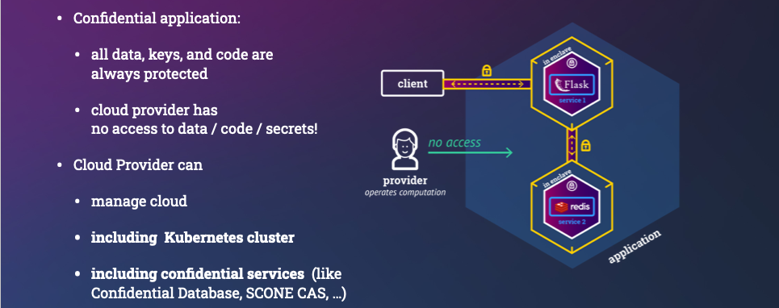
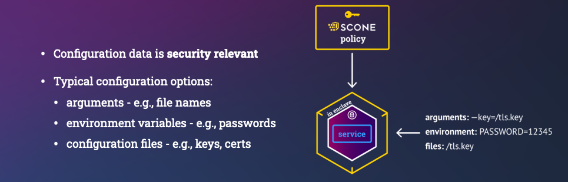
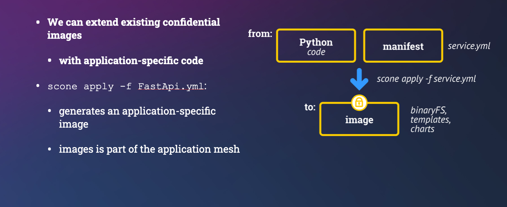
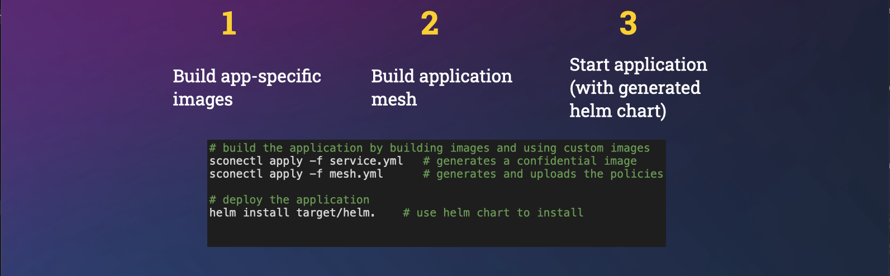

# Building a Confidential Flask-Based Application using `sconectl`

We **demonstrate** with the help of a simple Flask-based Service multiple features of the SCONE platform:

- we show that we can execute **unmodified Python** programs inside of SGX enclaves
- we show how to **encrypt the Python program** to protect the **confidentiality** and **integrity** of the Python code
- how to **implicitly attest other services** with the help of TLS, i.e., to ensure that one communicates with a service that satisfy its security policy.
    - we demonstrate how Redis, an in-memory data structure store, and the Python flask **attest each other** via **TLS** without needing to change the code of neither Redis nor the Flask-based service.
- we show how to **generate TLS certificates** with the help of a policy:
    - a SCONE security policy describes how to attest applications and services (i.e., describe the code, the filesystem state, the environment, the node on which to execute, and secrets).
    - a SCONE policy can generate secrets and in particular, key-pairs and TLS certificates.
- we show how to execute this example
    - on a generic Kubernetes cluster, and


## Workflow

We build a Python image very similar how you would build a native Python image:

- specify a set of dependencies that need to be installed with the help of a `requirements.txt` file
- 

## Flask-Based Confidential Service

We implement a simple Flask-based service. The Python [code](https://github.com/scontain/flask_example/blob/master/rest_api.py) implements a REST API:

- to store patient records (i.e., POST to resource `/patient/<string:patient_id>`)
- to retrieve patient records (i.e., GET of resource `/patient/<string:patient_id>`)
- to retrieve some *score* for a patient (i.e., GET of ressource `'/score/<string:patient_id>`)

The Python code is executed inside of an enclave to ensure that even users with root access cannot read the patient data.

## TLS Certificates

The service uses a Redis instance to store the resources. The communication between 1) the Flask-based service and its clients and  2) Redis and the application is encrypted with the help of TLS. To do so, we need to provision the application and Redis with multiple keys and certificates:

- Redis client certificate
- Redis server certificate
- Flask server certificate

Redis and the Flask-based service, require that the private keys and certificates are stored in the filesystem. We generate and provision these TLS-related files with the help of a [SCONE policy](https://sconedocs.github.io/CAS_session_lang_0_3/). 

To do so, we generate **secrets** related to the Flask-based service. We specify in the [flask policy](https://github.com/scontain/flask_example/blob/master/flask-template.yml) that

- a private key (`api_ca_key`) for a new certificate authority (CA) is generated
- a certificate (`api_ca_cert`) for a certification authority is generated
  - using the private key (i.e., `api_ca_key`), and
  - making this certificate available to everybody (see `export_public: true`)
- we generate a private key for the certificate used by the REST API (i.e., `flask_key`)
- we generate a certificate (`flask`) with the help of CA `api_ca_cert` and assign it a dns name `api`.

The SCONE policy is based on Yaml and the [flask policy](https://github.com/scontain/flask_example/blob/master/flask-template.yml) contains the following section to define these secrets:

```YML
secrets:
    - name: api_ca_key
      kind: private-key
    - name: api_ca_cert
      kind: x509-ca
      export_public: true
      private_key: api_ca_key
    - name: flask_key
      kind: private-key
    - name: flask
      kind: x509
      private_key: flask_key
      issuer: api_ca_cert
      dns:
        - api
```

The private keys and certificates are expected at certain locations in the file system. SCONE permits to map these secrets into the filesystem of the Flask-based service: these files are only  visible to the service inside of an SGX enclave after a successful attestation (see below) and in particular, not visible on the outside i.e., in the filesystem of the container.

To map the private keys and certificates into the filesystem of a service, we specify in the policy which secrets are visible to a service at which path. In the [flask policy](https://github.com/scontain/flask_example/blob/master/flask-template.yml) this is done as follows:

```YML
images:
   - name: flask_restapi_image
     injection_files:
        - path: /tls/flask.crt
          content: $$SCONE::flask.crt$$
        - path: /tls/flask.key
          content: $$SCONE::flask.key$$
```

And in the Python program, one can just access these files as normal files. One can create a SSL context (see [code](https://github.com/scontain/flask_example/blob/master/rest_api.py)):

```Python
    app.run(host='0.0.0.0', port=4996, threaded=True, ssl_context=(("/tls/flask.crt", "/tls/flask.key")))
```

While we do not show how to enforce client authentication of the REST API, we show how to do this for Redis in the next section.

## TLS-based Mutual Attestation

The communication between the Flask-based service, say, $S$ and Redis instance, say, $R$ is encrypted via TLS. Actually, we make sure that the service $S$ and instance $R$ **attest** each other. Attestation means that $S$ ensures that $R$ satisfies all requirements specified in $R$'s security policy and $R$ ensures that $S$ satisfies all the requirements of $S$'s policy. Of course, this should be done without changing the code of neither $S$ nor $R$. In case that $S$ and $R$ are using TLS with client authentication, this is straightforward to enforce. (If this is not the case, please contact us for an alternative.)

To ensure mutual attestation, the operator of Redis defines a [policy](https://github.com/scontain/flask_example/blob/master/redis-template.yml) in which it defines a certification authority (`redis_ca_cert`) and defines both a Redis certificate (`redis_ca_cert`) as well as a Redis client certificate (`redis_client_cert`). The client certificate and the private key (`redis_client_key`) are exported to the policy of the Flask service $S$. The policy for this looks like this:

```yml
secrets:
  - name: redis_key
    kind: private-key
  - name: redis # automatically generate Redis server certificate
    kind: x509
    private_key: redis_key
    issuer: redis_ca_cert
    dns:
     - redis
  - name: redis_client_key
    kind: private-key
    export:
    - session: $FLASK_SESSION
  - name: redis_client_cert # automatically generate client certificate
    kind: x509
    issuer: redis_ca_cert
    private_key: redis_client_key
    export:
    - session: $FLASK_SESSION # export client cert/key to client session
  - name: redis_ca_key
    kind: private-key
  - name: redis_ca_cert # export session CA certificate as Redis CA certificate
    kind: x509-ca
    private_key: redis_ca_key
    export:
    - session: $FLASK_SESSION # export the session CA certificate to client session
```

Note that `$FLASK_SESSION` is replaced by the unique name of the policy of $S$. The security
policies are in this example on the same [SCONE CAS (Configuration and Attestation Service)](helm_cas.md). In more complex scenarios, the policies could also be stored on separate SCONE CAS instances operated by different entities.

The flask service can import the Redis CA certificate, client certificate and private key as follows:

```yml
secrets:
    - name: redis_client_key
      import:
        session: $REDIS_SESSION
        secret: redis_client_key
    - name: redis_client_cert
      import:
        session: $REDIS_SESSION
        secret: redis_client_cert
    - name: redis_ca_cert
      import:
        session: $REDIS_SESSION
        secret: redis_ca_cert
```

These secrets are made available to the Flask-based service in the filesystem (i.e., files `/tls/redis-ca.crt`, `/tls/client.crt` and `/tls/client.key`) via the following entries in its security policy:

```yml
images:
   - name: flask_restapi_image
     injection_files:
        - path: /tls/redis-ca.crt
          content: $$SCONE::redis_ca_cert.chain$$
        - path: /tls/client.crt
          content: $$SCONE::redis_client_cert.crt$$
        - path: /tls/client.key
          content: $$SCONE::redis_client_cert.key$$
```

Note that before uploading a policy to SCONE CAS, one first attests that one indeed communicates with a genuine SCONE CAS running inside of a production enclave. This is done with the help of a [SCONE CAS CLI](../helm_cas/#attesting-scone-cas).

## Code

The source code of this example is open source and available on github:

```bash
git clone https://github.com/scontain/flask_example.git
cd flask_example
```

## Run Service On Local Computer

You can use `docker-compose` to run this example on your local SGX-enabled computer as follows.
You first generate an encrypted image using script `create_image.sh`. This generates some environment variables that stored in file `myenv` and are loaded via `source myenv`. The service and Redis are started with `docker-compose up`.

```bash
./create_image.sh
source myenv
docker-compose up
```

We use a public instance of SCONE CAS in this example.

### Testing the service

Retrieve the API certificate from CAS:

```bash
source myenv
curl -k -X GET "https://${SCONE_CAS_ADDR-cas}:8081/v1/values/session=$FLASK_SESSION" | jq -r .values.api_ca_cert.value > cacert.pem
```

Since the API certificates are issued to the host name "api", we have to use it. You can rely on cURL's --resolve option to point to the actual address (you can also edit your /etc/hosts file).

```bash
export URL=https://api:4996
```

```bash
curl --cacert cacert.pem -X POST ${URL}/patient/patient_3 -d "fname=Jane&lname=Doe&address='123 Main Street'&city=Richmond&state=Washington&ssn=123-223-2345&email=nr@aaa.com&dob=01/01/2010&contactphone=123-234-3456&drugallergies='Sulpha, Penicillin, Tree Nut'&preexistingconditions='diabetes, hypertension, asthma'&dateadmitted=01/05/2010&insurancedetails='Primera Blue Cross'" --resolve api:4996:127.0.0.1
curl --cacert cacert.pem -X GET ${URL}/patient/patient_3 --resolve api:4996:127.0.0.1
curl --cacert cacert.pem -X GET ${URL}/score/patient_3 --resolve api:4996:127.0.0.1
```

The output might look as follows:

```txt
$ curl --cacert cacert.pem -X POST https://localhost:4996/patient/patient_3 -d "fname=Jane&lname=Doe&address='123 Main Street'&city=Richmond&state=Washington&ssn=123-223-2345&email=nr@aaa.com&dob=01/01/2010&contactphone=123-234-3456&drugallergies='Sulpha, Penicillin, Tree Nut'&preexistingconditions='diabetes, hypertension, asthma'&dateadmitted=01/05/2010&insurancedetails='Primera Blue Cross'" --resolve api:4996:127.0.0.1
{"address":"'123 Main Street'","city":"Richmond","contactphone":"123-234-3456","dateadmitted":"01/05/2010","dob":"01/01/2010","drugallergies":"'Sulpha, Penicillin, Tree Nut'","email":"nr@aaa.com","fname":"Jane","id":"patient_3","insurancedetails":"'Primera Blue Cross'","lname":"Doe","preexistingconditions":"'diabetes, hypertension, asthma'","score":0.1168424489618366,"ssn":"123-223-2345","state":"Washington"}
$ curl --cacert cacert.pem -X GET localhost:4996/patient/patient_3 --resolve api:4996:127.0.0.1
{"address":"'123 Main Street'","city":"Richmond","contactphone":"123-234-3456","dateadmitted":"01/05/2010","dob":"01/01/2010","drugallergies":"'Sulpha, Penicillin, Tree Nut'","email":"nr@aaa.com","fname":"Jane","id":"patient_3","insurancedetails":"'Primera Blue Cross'","lname":"Doe","preexistingconditions":"'diabetes, hypertension, asthma'","score":0.1168424489618366,"ssn":"123-223-2345","state":"Washington"}
$ curl --cacert cacert.pem -X GET localhost:4996/score/patient_3 --resolve api:4996:127.0.0.1
{"id":"patient_3","score":0.2781606437899131}
```

## Execution on a Kubernetes Cluster and AKS

You can run this example on a Kubernetes cluster or Azure Kubernetes Service (AKS).

### Install SCONE services

Get access to `SconeApps` (see <https://sconedocs.github.io/helm/>):

```bash
helm repo add sconeapps https://${GH_TOKEN}@raw.githubusercontent.com/scontain/sconeapps/master/
helm repo update
```

Give SconeApps access to the private docker images by generating an access token on  <https://gitlab.scontain.com/-/profile/personal_access_tokens> to `read_registry` and set:

```bash
export SCONE_HUB_USERNAME=...
export SCONE_HUB_ACCESS_TOKEN=...
export SCONE_HUB_EMAIL=...

kubectl create secret docker-registry sconeapps --docker-server=registry.scontain.com:5050 --docker-username=$SCONE_HUB_USERNAME --docker-password=$SCONE_HUB_ACCESS_TOKEN --docker-email=$SCONE_HUB_EMAIL
```

Start LAS:

```bash
helm install las sconeapps/las  --set image=registry.scontain.com:5050/sconecuratedimages/kubernetes:las-scone4.2.1 --set service.hostPort=true
```

If you use a local cas, you can start this cas service as follows:

```bash
helm install cas sconeapps/cas --set image=registry.scontain.com:5050/sconecuratedimages/services:cas-scone4.2.1
```

Install the SGX device plugin for Kubernetes:

```bash
helm install sgxdevplugin sconeapps/sgxdevplugin
```

### Run the application

Start by creating a Docker image and setting its name. Remember to specify a repository to which you are allowed to push:

```bash
export IMAGE=registry.scontain.com:5050/sconecuratedimages/application:v0.4 # please change to an image that you can push
./create_image.sh
source myenv
docker push $IMAGE
```

Use the Helm chart in [`deploy/helm`](https://github.com/scontain/flask_example/tree/master/deploy/helm) to deploy the application to a Kubernetes cluster.

```bash
helm install api-v1 deploy/helm \
   --set image=$IMAGE \
   --set scone.cas=$SCONE_CAS_ADDR \
   --set scone.flask_session=$FLASK_SESSION/flask_restapi \
   --set scone.redis_session=$REDIS_SESSION/redis \
   --set service.type=NodePort \
   --set redis.image=registry.scontain.com:5050/sconecuratedimages/apps:redis-6-alpine-scone4.2.1
```

**NOTE**: Setting `service.type=LoadBalancer` will allow the application to get traffic from the internet (through a managed LoadBalancer).

### Test the application

After all resources are `Running`, you can test the API via Helm:

```bash
helm test api-v1
```

Helm will run a pod with a couple of pre-set queries to check if the API is working properly.

### Access the application

If the application is exposed to the world through a service of type LoadBalancer, you can retrieve its CA certificate from CAS:

```bash
source myenv
curl -k -X GET "https://${SCONE_CAS_ADDR-cas}:8081/v1/values/session=$FLASK_SESSION" | jq -r .values.api_ca_cert.value > cacert.pem
```

Retrieve the service public IP address:

```bash
export SERVICE_IP=$(kubectl get svc --namespace default api-v1-example --template "{{ range (index .status.loadBalancer.ingress 0) }}{{.}}{{ end }}")
```

Since the API certificates are issued to the host name "api", we have to use it. You can rely on cURL's --resolve option to point to the actual address (you can also edit your /etc/hosts file).

```bash
export URL=https://api
```

Now you can perform queries such as:

```bash
curl --cacert cacert.pem -X POST ${URL}/patient/patient_3 -d "fname=Jane&lname=Doe&address='123 Main Street'&city=Richmond&state=Washington&ssn=123-223-2345&email=nr@aaa.com&dob=01/01/2010&contactphone=123-234-3456&drugallergies='Sulpha, Penicillin, Tree Nut'&preexistingconditions='diabetes, hypertension, asthma'&dateadmitted=01/05/2010&insurancedetails='Primera Blue Cross'" --resolve api:443:${SERVICE_IP}
```

### Clean up

```bash
helm delete cas
helm delete las
helm delete sgxdevplugin
helm delete api-v1
kubectl delete pod api-v1-example-test-api
```

Next, we introduce the different sconified Python versions that we support.

# Confidential Hello World!

We show how to provide cloud-native applications with secrets such that **nobody** except our program can access these secrets. In fact, not even users with root privileges and cloud providers with hardware access can access them. We need to protect the data during runtime but also the secrets that we provision to the application:



## Hello World!

We start with a simple *Hello World* example, in which we pass a user ID and a password to a Python program. This is actually an API user and password, i.e., no human need or should know the password: Only *authorized* applications should have access to the password. This means that we need to define which programs are authorized and which are not.




We want to execute this program in a typical environment that is managed by a cloud provider. More concretely, we want to run this program as a process running in a container running in a pod, running in a Kubernetes node, running in a VM running on a server running in some data center. So there are multiple nested layers that one might need to be aware of. These days, we want to outsource the management of these layers to an external provider.

The cloud provider operates the hardware, the cloud stack, the operating system, and Kubernetes. What we need to ensure is that nobody (except our program) can change read our password (we ensure confidentiality) nor can change the user ID.

Neither cloud provider nor system admins will be able to see the parameters or change the program.

This program could look as follows:

```python
import os

# Get some environment variables
API_USER = os.getenv('API_USER')
API_PASSWORD = os.environ.get('API_PASSWORD')

# Exit with error if one is not defined
if API_USER == None or API_PASSWORD == None:
    print("Not all required environment variables are defined!")
    exit(1)

# Print API_USER - this is - unlike the API_PASSWORD - not confidential
print(f"Hello '{API_USER}' - we protect the confidentiality of API_PASSWORD")
```

## Objectives

Our objective is that it must be impossible both:

1. to view and modify the password, and
2. to modify the program

by both  

1. a system admin or any other user with root access, and
2. a cloud provider or anybody else with physical access to the hardware.

Using SCONE it is also possible to protect the code confidentiality so that nobody can view the program, but we do not include this feature in this example.


## Create Manifest Files

The first thing you need to do is to create the manifest files describing your services and how they should be connected in your application.
The manifests are used to build confidential container images and to generate and upload the security policy for your confidential application. This is done in one **service manifest** file per service and one **mesh manifest** file (a.k.a. **Meshfile**), which is used to generate the security policies and global variables.


In this example, there is only one service and both its service and mesh manifest files have been created for you (`service.yml` and `mesh.yml`).



Note that you do not need a service manifest for **curated confidential service** like `memcached`, `nginx`, `MariaDB`, etc: the images already contain all required information. We show this in a different tutorial.

## Quick Start

Once you have created your manifest files, you only need to perform the following three steps to build and run your confidential application on Kubernetes:



**Note**: Since the container **repository** and the **namespace** is under our control, you might want to change the image name to a repository to which you are permitted to push. Also, you might need to change the namespace.

1. Build the service OCI container image (for each service):

```bash
sconectl apply -f service.yml
```

2. Build and upload the security policies for all services of the application using:

```bash
sconectl apply -f mesh.yml
```

3. The second step generates a `helm` chart and you can start this application by executing:

```bash
helm install pythonapp target/helm
```

That's it! You can now inspect the output with `kubectl` (assuming you have  `kubectl` command completion installed):

```bash
kubectl logs pythonapp<TAB>
```

But in case you are interested in what is going on under the hood, we explain the steps in some more details below.

### Notes

- In some deployments, new images might be automatically deployed. If this is the case, ensure that the container images that are generated in step 1. are not deployed automatically by adding option `--no-push`.
- Container images are only permitted to deployed after the security policies are created or updated in step 2. Ensure that the images are only deployed after step 2.
- For example, you might push the images only after step 2 to the cluster.

## Building a Confidential Image

Our objective is to build a confidential container image to run this application in an encrypted memory region (aka enclave) and ensure that environment variables are securely passed to the application only after the application was attested and verified. Otherwise, one could, by changing the arguments passed to a Python engine, run completely different functionality.

Note that we want to outsource the management of Kubernetes to an external provider. Hence, we do not want Kubernetes nor any Kubernetes admin to be able to see the value of our environment variables - at no time: neither during the runtime nor during the startup time. Of course, only our original Python program should be able to be able to access the value. Any modification of the Python program must be detected.

Note also that the cloud provider takes care of the integrity of the Kubernetes cluster using traditional isolation mechanisms (e.g., isolation using VMs and containers).  Kubernetes will not have access to any data, code, or key material of the application: their confidentiality, integrity and freshness will all be protected by SCONE. 

We can build a confidential container images and applications consisting of multiple container images with the help of a manifests:

- `meshfile`:  describes how to build an application consisting of one or more images. This is defined by the application owner. This can define values that need to be **integrity** and **freshness** protected. We should avoid to define values that need to be **confidential** since admins of the application owner might see the meshfile.
- `service manifest`: describes how to build a confidential image to deploy a confidential service. For example, we want to run a Python program inside an enclave. This `service manifest` is defined by the application or service owner.
- `security policy`:  describes how to attest a service and to provision secrets / configuration to a service instance. This is automatically derived form the `meshfile` and `service file`. It can generate secrets that now admin can see. These secrets can be generated inside of an enclave or these secrets can be retrieved from an external key store like a HSM.

### Service Manifest

Our Python program uses environment variables that need to be protected:

- `API_USER` is an environment variable that is defined in the `Meshfile` . Hence, we add it to the `global` section. We could define a default value in the service manifest. This variable is integrity protected. While a cloud provider would not be able to see the value, an admin of the application owner might be able to see this. (Note that our Python program prints this value on the console indicating that we only want to protect its integrity).

- `API_PASSWORD` is an API password and should not be known by anybody - not even an admin by the application owner. Hence, we ask SCONE CAS (Configuration and Attestation Service) to randomly select it inside an enclave.
  - We define a secret with name `password` as part of the secrets section. This has a length of 10 characters that are randomly selected by SCONE CAS.
  - The value of this secret can be referred to by "$$SCONE::password". This value is only available for our Python program. In general, we recommend to share secrets amongst the services of the same application mesh only.
  - We define this locally in the manifest for this service. Hence, we define it in section `local` - this cannot be modified in the `Meshfile` (i.e., a manifest that describes how to connect services).

We build the confidential container image with the help of the `build` section:

- `name`: set the name of the service deployed with this container image.
- `kind`: `Python says that we need a Python engine to execute this program
- `to`: is the name of the generated image
- `pwd`: the working directory in which our Python program will be located
- `command`:  this is the command line. This is protected to ensure that an adversary cannot change the arguments of our program. Changing the arguments would permit the adversary, for example, to print the value of the environment variables.
- `copy`: a list of files or directories to copy into the image.

```yml
apiVersion: scone/5.8
kind: genservice

# define environment variables
#  - local ones are only visible for this service
#  - global ones are defined for all services in a mesh

environment:
  local:
    - name: SCONE_HEAP
      value: 760M
    - name: SCONE_LOG
      value: error
    - name: API_PASSWORD
      value: "$$SCONE::password$$"  # get from CAS
  global:     # values defined/overwritten in Meshfile
    - name: API_USER  # get value from Meshfile

# define secrets that are managed by CAS 
secrets:
  global: 
  - name: password
    kind: ascii
    size: 10

build:
  name: python_hello_user
  kind: python
  to: registry.scontain.com:5050/cicd/python_hello_user:latest
  pwd: /python
  command: python3 print_env.py
  copy:
    - print_env.py
```

## Application Manifest (aka `meshfile`)

A cloud-native application typically consists of multiple services. In this example, we start with one service.

To run an application, we need to specify which CAS instance we want to use. Actually, we typically can use multiple CAS instances for various aspects.

Each application must define its own unique CAS namespace. This could have the same name as the namespace that we use to run this application in Kubernetes.

We can define the environment variables that are marked as `global` by the individual services. If no default value was given, we must define a value here.

The service section describes the set of services from which this application is composed of:

- `name`: is a unique name of this service
- `image`: is the name of the image.

```yml
apiVersion: scone/5.8
kind: mesh

cas:
  - name: cas # cas used to store the policy of this application
    alias: ["image", "security", "access", "attestation"] # use alias in case CAS instance has multiple roles
    cas_url: edge.scone-cas.cf  # exported as {{cas_cas_cas_url}}
    tolerance: "--only_for_testing-trust-any --only_for_testing-debug  --only_for_testing-ignore-signer -C -G -S"

policy:
  namespace: myPythonApp    # namespace on CAS instance `cas`

# define environment variables   
env:
  - name: API_USER 
    value: myself
  - name: imagePullSecrets
    value: SconeApps
  - name: APP_SERVICE_PORT
    value: 443

services:
  - name: pythonapp
    image: registry.scontain.com:5050/cicd/python_hello_user:latest
```

## Setup

We have implemented `sconectl` in Rust. In case, you have Rust already installed, just execute:

```bash
cargo install sconectl
```

### Troubleshooting

**Note**: You can run script `run.sh` to set up / update your rust environment and to  install `sconectl` with the help of Rust. It will also execute the remaining steps of this tutorial.

In case you install manually, errors might appear since Rust is not installed or out-of-date. If this `cargo` would fail, ensure that

- you have `Rust` installed on your system. and 
- it is up-to-date (you might get syntax errors if your Rust installation is old).

If Rust is not yet installed or too old, you can use [`rustup`](https://www.rust-lang.org/tools/install) to install `Rust`.

## Example

Depending what Manifest you apply, different command line options might be available. To get a list of options, for a given manifest, you can execute:

```bash
sconectl apply -f service.yml --help
```

You can print which environment variables you can define and also their default values by executing:

```bash
sconectl apply -f service.yml -p
```

### Building a Service Image

We can now apply a manifest as follows (and we do not want to push to the repo just yet):

```bash
sconectl apply -f service.yml --no-push
```

### Displaying Environment Variables

We can show which variables must be defined in a `meshfile` using option `-p`:

```bash
sconectl apply -f mesh.yml -p
```
