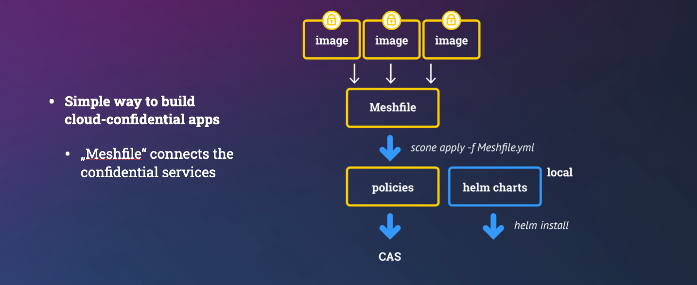

# Confidential Hello World!

We show how to provide cloud-native applications with secrets such that **nobody** except our program can access these secrets. In fact, not even users with root privileges and cloud providers with hardware access can access them. We need to protect the data during runtime but also the secrets that we provision to the application:


## Hello World!

We start with a simple *Hello World* example, in which we pass a user ID and a password to a Python program. This is actually an API user and password, i.e., no human need or should know the password: Only *authorized* applications should have access to the password. This means that we need to define which programs are authorized and which are not.


We want to execute this program in a typical environment that is managed by a cloud provider. More concretely, we want to run this program as a process running in a container running in a pod, running in a Kubernetes node, running in a VM running on a server running in some data center. So there are multiple nested layers that one might need to be aware of. These days, we want to outsource the management of these layers to an external provider.

The cloud provider operates the hardware, the cloud stack, the operating system, and Kubernetes. What we need to ensure is that nobody (except our program) can change read our password (we ensure confidentiality) nor can change the user ID.

Neither cloud provider nor system admins will be able to see the parameters or change the program.

This program could look as follows:

```python
import os

# Get some environment variables
API_USER = os.getenv('API_USER')
API_PASSWORD = os.environ.get('API_PASSWORD')

# Exit with error if one is not defined
if API_USER == None or API_PASSWORD == None:
    print("Not all required environment variables are defined!")
    exit(1)

# Print API_USER - this is - unlike the API_PASSWORD - not confidential
print(f"Hello '{API_USER}' - we protect the confidentiality of API_PASSWORD")
```

## Objectives

Our objective is that it must be impossible both:

1. to view and modify the password, and
2. to modify the program

by both  

1. a system admin or any other user with root access, and
2. a cloud provider or anybody else with physical access to the hardware.

Using SCONE it is also possible to protect the code confidentiality so that nobody can view the program, but we do not include this feature in this example.


## Create Manifest Files

The first thing you need to do is to create the manifest files describing your services and how they should be connected in your application.
The manifests are used to build confidential container images and to generate and upload the security policy for your confidential application. This is done in one **service manifest** file per service and one **mesh manifest** file (a.k.a. **Meshfile**), which is used to generate the security policies and global variables.



In this example, there is only one service and both its service and mesh manifest files have been created for you (`service.yml` and `mesh.yml`).


Note that you do not need a service manifest for **curated confidential service** like `memcached`, `nginx`, `MariaDB`, etc: the images already contain all required information. We show this in a different tutorial.

## Quick Start

Once you have created your manifest files, you only need to perform the following three steps to build and run your confidential application on Kubernetes:


### Prerequisites

In this example, the manifests use a container **repository** and a SCONE CAS **namespace** that is under our control. Hence,

- We generate an image and we make this image available to your Kubernetes cluster. We therefore push this image to a repo. Change the image name (`to`, `image`) in the two manifests to a repository to which you are permitted to push.
- You need to change the namespace (`namespace`) used in the `meshfile` manifest (see below),
- You need to have `sconectl` installed (see below), and
- You need a Kubernetes cluster with
  - our [SCONE SGX Plugin](https://sconedocs.github.io/helm_sgxdevplugin/) installed, and
  - our [SCONE LAS](https://sconedocs.github.io/helm_las/) installed.

### Commands

1. Build the service OCI container image (for each service):

```bash
sconectl apply -f service.yml
```

If you do not have `sconectl` installed, please [`install sconectl`]().

2. Build and upload the security policies for all services of the application using:

```bash
sconectl apply -f mesh.yml
```

The locations of the artifacts are as follows:

- container images are in one or more repos
- the policies are stored in a SCONE CAS instance
- the helm charts are stored in a local directory on the computer on which we execute `sconectl`.


1. The second step generates a `helm` chart and you can start this application by executing:

```bash
helm install pythonapp target/helm
```


That's it!

You can now inspect the output with `kubectl` (assuming you have  `kubectl` command completion installed):

```bash
kubectl logs pythonapp<TAB>
```

Regarding the locations of the artifacts:

- we typically use one repo near the Kubernetes cluster to store all images. We protect the access to this repo using a Kubernetes secret. Typically, we use a secret `sconeapps`,
- the helm charts are located on a computer of the dev ops team, and
- the the policies are stored in a SCONE CAS instance in the cluster.


But in case you are interested in what is going on under the hood, we explain the steps in some more details below.

### Notes

- In some deployments, new images might be automatically deployed. If this is the case, ensure that the container images that are generated in step 1. are not deployed automatically by adding option `--no-push`.
- Container images are only permitted to deployed after the security policies are created or updated in step 2. Ensure that the images are only deployed after step 2.
- For example, you might push the images only after step 2 to the cluster.

## Building a Confidential Image

Our objective is to build a confidential container image to run this application in an encrypted memory region (aka enclave) and ensure that environment variables are securely passed to the application only after the application was attested and verified. Otherwise, one could, by changing the arguments passed to a Python engine, run completely different functionality.

Note that we want to outsource the management of Kubernetes to an external provider. Hence, we do not want Kubernetes nor any Kubernetes admin to be able to see the value of our environment variables - at no time: neither during the runtime nor during the startup time. Of course, only our original Python program should be able to be able to access the value. Any modification of the Python program must be detected.

Note also that the cloud provider takes care of the integrity of the Kubernetes cluster using traditional isolation mechanisms (e.g., isolation using VMs and containers).  Kubernetes will not have access to any data, code, or key material of the application: their confidentiality, integrity and freshness will all be protected by SCONE. 

We can build a confidential container images and applications consisting of multiple container images with the help of a manifests:

- `meshfile`:  describes how to build an application consisting of one or more images. This is defined by the application owner. This can define values that need to be **integrity** and **freshness** protected. We should avoid to define values that need to be **confidential** since admins of the application owner might see the meshfile.
- `service manifest`: describes how to build a confidential image to deploy a confidential service. For example, we want to run a Python program inside an enclave. This `service manifest` is defined by the application or service owner.
- `security policy`:  describes how to attest a service and to provision secrets / configuration to a service instance. This is automatically derived form the `meshfile` and `service file`. It can generate secrets that now admin can see. These secrets can be generated inside of an enclave or these secrets can be retrieved from an external key store like a HSM.

### Service Manifest

Our Python program uses environment variables that need to be protected:

- `API_USER` is an environment variable that is defined in the `Meshfile` . Hence, we add it to the `global` section. We could define a default value in the service manifest. This variable is integrity protected. While a cloud provider would not be able to see the value, an admin of the application owner might be able to see this. (Note that our Python program prints this value on the console indicating that we only want to protect its integrity).

- `API_PASSWORD` is an API password and should not be known by anybody - not even an admin by the application owner. Hence, we ask SCONE CAS (Configuration and Attestation Service) to randomly select it inside an enclave.
  - We define a secret with name `password` as part of the secrets section. This has a length of 10 characters that are randomly selected by SCONE CAS.
  - The value of this secret can be referred to by "$$SCONE::password". This value is only available for our Python program. In general, we recommend to share secrets amongst the services of the same application mesh only.
  - We define this locally in the manifest for this service. Hence, we define it in section `local` - this cannot be modified in the `Meshfile` (i.e., a manifest that describes how to connect services).

We build the confidential container image with the help of the `build` section:

- `name`: set the name of the service deployed with this container image.
- `kind`: `Python says that we need a Python engine to execute this program
- `to`: is the name of the generated image
- `pwd`: the working directory in which our Python program will be located
- `command`:  this is the command line. This is protected to ensure that an adversary cannot change the arguments of our program. Changing the arguments would permit the adversary, for example, to print the value of the environment variables.
- `copy`: a list of files or directories to copy into the image.

```yml
apiVersion: scone/5.8
kind: genservice

# define environment variables
#  - local ones are only visible for this service
#  - global ones are defined for all services in a mesh

environment:
  local:
    - name: SCONE_HEAP
      value: 760M
    - name: SCONE_LOG
      value: error
    - name: API_PASSWORD
      value: "$$SCONE::password$$"  # get from CAS
  global:     # values defined/overwritten in Meshfile
    - name: API_USER  # get value from Meshfile

# define secrets that are managed by CAS 
secrets:
  global: 
  - name: password
    kind: ascii
    size: 10

build:
  name: python_hello_user
  kind: python
  to: registry.scontain.com:5050/cicd/python_hello_user:latest
  pwd: /python
  command: python3 print_env.py
  copy:
    - print_env.py
```

## Application Manifest (aka `meshfile`)

A cloud-native application typically consists of multiple services. In this example, we start with one service.

To run an application, we need to specify which CAS instance we want to use. Actually, we typically can use multiple CAS instances for various aspects.

Each application must define its own unique CAS namespace. This could have the same name as the namespace that we use to run this application in Kubernetes.

We can define the environment variables that are marked as `global` by the individual services. If no default value was given, we must define a value here.

The service section describes the set of services from which this application is composed of:

- `name`: is a unique name of this service
- `image`: is the name of the image.

```yml
apiVersion: scone/5.8
kind: mesh

cas:
  - name: cas # cas used to store the policy of this application
    alias: ["image", "security", "access", "attestation"] # use alias in case CAS instance has multiple roles
    cas_url: edge.scone-cas.cf  # exported as {{cas_cas_cas_url}}
    tolerance: "--only_for_testing-trust-any --only_for_testing-debug  --only_for_testing-ignore-signer -C -G -S"

policy:
  namespace: myPythonApp    # namespace on CAS instance `cas`

# define environment variables   
env:
  - name: API_USER 
    value: myself
  - name: imagePullSecrets
    value: SconeApps
  - name: APP_SERVICE_PORT
    value: 443

services:
  - name: pythonapp
    image: registry.scontain.com:5050/cicd/python_hello_user:latest
```

## Setup

We have implemented `sconectl` in Rust. In case, you have Rust already installed, just execute:

```bash
cargo install sconectl
```

### Troubleshooting

**Note**: You can run script `run.sh` to set up / update your rust environment and to  install `sconectl` with the help of Rust. It will also execute the remaining steps of this tutorial.

In case you install manually, errors might appear since Rust is not installed or out-of-date. If this `cargo` would fail, ensure that

- you have `Rust` installed on your system. and 
- it is up-to-date (you might get syntax errors if your Rust installation is old).

If Rust is not yet installed or too old, you can use [`rustup`](https://www.rust-lang.org/tools/install) to install `Rust`.

## Example

Depending what Manifest you apply, different command line options might be available. To get a list of options, for a given manifest, you can execute:

```bash
sconectl apply -f service.yml --help
```

You can print which environment variables you can define and also their default values by executing:

```bash
sconectl apply -f service.yml -p
```

### Building a Service Image

We can now apply a manifest as follows (and we do not want to push to the repo just yet):

```bash
sconectl apply -f service.yml --no-push
```

### Displaying Environment Variables

We can show which variables must be defined in a `meshfile` using option `-p`:

```bash
sconectl apply -f mesh.yml -p
```
